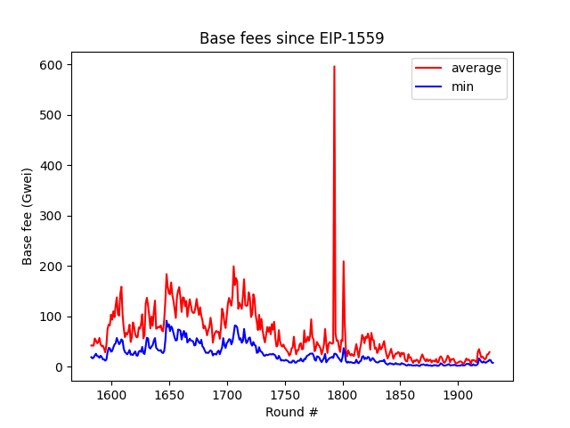

# Daily Gas Floor

A fully on-chain, decentralized, and incentive-compatible gas price oracle built on [Relic Protocol](https://docs.relicprotocol.com).

## Disclaimer

This code is meant as a proof-of-concept and is not yet intended for use in production. Feedback or contributions are always welcome! Feel free to get in touch on GitHub or on our [Discord](https://discord.gg/RelicProtocol)!

## How it works

### Rounds

Daily Gas Floor (DGF) divides time into _rounds_ consisting of 8192 blocks (roughly 27 hours), where its price feed contains the minimum base fee from each round. During a round, DGF discovers the price from the previous round in a decentralized way (described below). After this full round of discovery, the price is finalized and made available.

### Operation and Incentives

DGF discovers prices using a combination of Relic's [historical block header proofs](https://github.com/Relic-Protocol/relic-contracts/tree/main/contracts/provers/BlockHeaderProver.sol) and economic incentives. This relies on two open and permissionless roles:

* *_Submitters_* submit block headers which contain the submitter's claimed minimum base fee. DGF validated the block header using Relic, and tracks the minimum submission. After the end of the round, the first submitter of the minimum price can claim a reward.
* *_Depositors_* deposit ETH to fund the rewards, incentivizing price submission. Depositors are charged for the rewards in a round-robin fashion, and have the privileged ability to query the price feed, as long as their balance remains nonzero.

The submission reward scales up linearly throughout the round with the goal of finding a fair reward surpassing the current cost of submission. Note that submission rewards are MEV, and a competitive set of submitters should ensure that rewards are minimal.

For gas efficiency, depositors are stored using a circular linked list, allowing for cheap insertion and deletion while also preserving the round-robin ordering. New depositors are added to the *front* of the queue, favoring earlier depositors.

### Why is Relic needed?

The EVM's history access is limited to the last 256 block hashes. Efficiently accessing data from older blocks is a difficult problem, but is exactly what Relic's [block hash oracle](https://github.com/Relic-Protocol/relic-contracts/blob/main/contracts/BlockHistory.sol) solves. Relic uses zk-SNARKs to reduce long hash chains to compact Merkle trees, allowing applications such as DGF to securely access historical blocks with very little gas overhead.

### Example

Suppose Alice and Bob are two parties who want to query DGF's price feed on-chain, so Alice deposits 1 ETH and Bob deposits 2 ETH. Because they will be charged for rewards in a round-robin, Bob's deposit should last roughly twice as long as Alice's before needing to be topped up again.

Now suppose Xavier and Yolande are each acting as submitters, hoping to claim the rewards each round. Even if Xavier could profit from submitting the incorrect price (i.e. not the minimum from the round), it only takes one honest submitter (Yolande) to make Xavier's submission be wasted gas. So, Xavier and Yolande are both incentivized to submit the correct price and will race to do so.

However, suppose that gas prices are currently very high, so it would cost .02 ETH to submit the price while DGF's minimum reward is only .01 ETH. Throughout the round, DGF's reward for the round will gradually scale up to to some maximum (say, .1 ETH). As soon as this reward passes the current cost of submission, Yolande submits the block header and locks in the reward. DGF charges a depositor this reward, reducing Bob's balance and locking up the reward until Yolande decides to claim it. Once the round is finalized, Alice and Bob may query the settled price.

In practice, Alice and Bob would likely be DeFi protocols, while Xavier and Yolande would likely be MEV bots.

For more details, check out the code and accompanying documentation, or join our [Discord](https://discord.gg/RelicProtocol) to discuss!

## Use cases

The primary use case for such an oracle is derivative settlement. A gas price derivative used to hedge against prolonged gas price spikes could be valuable to any party that uses gas on a regular basis, such as rollup sequencers or oracle nodes.

It is sometimes thought that high volatility makes gas price derivatives impractical. However, the minimum base fee each round is substantially less volatile than the average:

## Comparison to other solutions

The closest alternative is [Chainlink's fast gas](https://data.chain.link/ethereum/mainnet/gas/fast-gas-gwei) oracle. This oracle has different goals - its price feed is much higher throughput, but is highly volatile and relies on trusted oracle nodes for relaying.

## Limitations and Future work

### Manipulation

One limitation to any gas price oracle is potential for price manipulation. For our case, some block proposers may have the opportunity to produce artificially empty blocks, which may reduce the minimum base fee below what the natural block-space demand would produce. EIP-1559 specifies that completely empty blocks reduce the base fee by only 12.5%, so substantially impacting the price requires controller many adjacent proposers. Producing empty blocks also comes at the cost of priority fees and MEV.

### Variations

Because Relic gives provable access to historical account balances, contract storage, and log emissions, this design can be easily adapted to create price oracles for any on-chain data. This includes AMM prices, NFT prices, and more!

### Other Limitations

There are a few known limitations to the current design:

1. The described design only supports price functions where candidate values are pairwise comparable (such as `min` or `max`), i.e. given any two candidate prices, we can always eliminate one of them. Functions such as `mean` or `median` require more context to compute, and would likely be more practical to compute off-chain and prove on-chain with a zk-SNARK.
2. Charging depositors in a round-robin has low amortized cost and is very gas-efficient, but may result in an unfair distribution of charges in the short-term if some rounds are especially expensive. Finding ways to more fairly distribute these costs (while keeping gas costs low) is left as future work.
3. Submission reward bounds are hard-coded and don't scale arbitrarily high, which could theoretically affect liveness. In practice, the current maximum reward should cover gas prices well above 500 gwei. Fully addressing this issue is difficult, as depositors may assign vastly different values to liveness on any given round.
